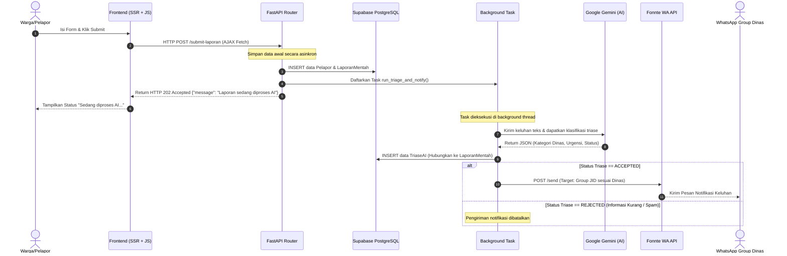

# Arsitektur Sistem LaporKita

Dokumen ini menjelaskan arsitektur tingkat tinggi (High-Level Architecture) dari sistem **LaporKita**, yang mencakup arsitektur backend, arsitektur frontend, serta aliran data dari pengaduan warga hingga disposisi ke grup WhatsApp dinas terkait.

---

## Diagram Aliran Sistem (System Workflow)

Proses dari awal warga mengirim laporan hingga dinas menerima notifikasi di grup WhatsApp dapat digambarkan sebagai berikut:



---

## Arsitektur Backend (Server-Side)

Backend **LaporKita** dibangun dengan menggunakan kerangka kerja **FastAPI** yang asinkronus (async/await), dengan pola pemisahan lapisan (Separation of Concerns):

### 1. Lapisan API & Routing (`app/api/`)
Menangani HTTP Request dan Response. Memanfaatkan *Form Parsing* dari `python-multipart` untuk menerima data input warga dari halaman web dan mengembalikan respons JSON instan dengan kode status `202 Accepted` untuk memotong latensi (bypass).

### 2. Lapisan Database & ORM (`app/db/`)
Menggunakan **SQLAlchemy** (AsyncSession) sebagai ORM untuk berinteraksi dengan database **PostgreSQL di Supabase**.
- **Supabase Connection Pooling (Transaction Mode):** Karena database dihosting di Supabase dan menggunakan connection pooler (Pgbouncer) di port `6543`, SQLAlchemy dikonfigurasi secara khusus dengan menonaktifkan *prepared statements*:
  ```python
  connect_args={
      "prepared_statement_cache_size": 0,
      "statement_cache_size": 0
  }
  ```
  Ini mencegah error tabrakan sesi prepared statement antar transaksi.

### 3. Lapisan Layanan (Services - `app/services/`)
Modul independen untuk berinteraksi dengan layanan pihak ketiga:
- **`llm_service.py`**: Menggunakan `google-genai` SDK resmi untuk memanggil model `gemini-2.5-flash`. Menggunakan konfigurasi `response_mime_type="application/json"` dan system instruction yang ketat guna memaksa model mengembalikan data JSON murni untuk kemudahan pemrosesan.
- **`wa_service.py`**: Menggunakan pustaka HTTP client asinkronus `httpx.AsyncClient` untuk memicu pengiriman pesan via **Fonnte API** (`https://api.fonnte.com/send`).

### 4. Background Tasks (`app/tasks.py`)
Mengeksekusi proses triase AI dan notifikasi secara non-blocking di latar belakang menggunakan `BackgroundTasks` bawaan FastAPI. Hal ini memastikan pengguna tidak mengalami loading halaman yang lama saat sistem menghubungi API eksternal (Google Gemini dan Fonnte).

### 5. Otentikasi & Keamanan Portal Admin
Untuk menjaga kesederhanaan arsitektur dan meminimalkan celah keamanan permukaan:
- **Kredensial Tunggal Terpusat:** Sistem tidak lagi menyimpan akun petugas dinas di dalam basis data (tabel `petugas` ditiadakan). Sebagai gantinya, satu akun administrator tunggal dikonfigurasi langsung via variabel lingkungan `.env` (`ADMIN_USERNAME` dan `ADMIN_PASSWORD`).
- **Pencabutan Registrasi Mandiri:** Halaman pendaftaran petugas (`/admin/register`) dihapus untuk mencegah registrasi pihak luar yang tidak dikenal.
- **Manajemen Sesi JWT via Cookie HTTPOnly:** Autentikasi menggunakan JSON Web Token (JWT) yang di-generate langsung dari sisi server saat login berhasil, kemudian disimpan di cookie peramban dengan flag `HTTPOnly` dan `Secure`. Ini melindungi token dari pencurian melalui serangan Cross-Site Scripting (XSS).
- **Proteksi Endpoint:** Endpoint dashboard `/admin/dashboard` dan API statistik `/api/admin/*` diverifikasi oleh middleware/fungsi pemeriksa JWT token secara asinkron.
- **Pengambilan Detail Pelapor via ORM Join:** Saat admin memuat daftar laporan via `/api/admin/laporan`, backend melakukan join asinkronus ke tabel `Pelapor` untuk mengambil NIK, nama lengkap, dan nomor kontak pelapor guna disajikan secara mendalam di modal detail tanpa membiarkan data sensitif tersebut bocor ke publik atau terindeks mesin pencari.


---

## Arsitektur Frontend (Client-Side)

Frontend **LaporKita** dirancang sederhana namun interaktif dengan fokus pada performa SEO dan kegunaan (UX):

### 1. Server-Side Rendering (SSR) via Jinja2
Konten halaman utama ([index.html](file:///home/superbypassudin/.clone/Github/LaporKita/app/templates/index.html)) di-render langsung dari sisi server menggunakan Jinja2 Templates. Ini memungkinkan metadata SEO (Title, Description, dan Open Graph Tags) di-injeksi secara dinamis dan dapat dengan mudah diindeks oleh robot perayap mesin pencari (search engine crawlers).

### 2. Vanilla JS untuk Interaksi Asinkronus (AJAX)
Pengiriman formulir dikontrol menggunakan skrip [app.js](file:///home/superbypassudin/.clone/Github/LaporKita/app/static/js/app.js) dengan menangkap event `submit` dan memanggil `fetch()` API secara asinkron:
- Mencegah reload halaman penuh (`e.preventDefault()`).
- Mengubah tombol submit menjadi keadaan *loading* dengan animasi *spinner*.
- Menampilkan pesan status langsung di antarmuka pengguna setelah server merespons dengan `202 Accepted`.

### 3. Styling dengan Tailwind CSS
Menggunakan Tailwind CSS (via CDN) untuk mendesain antarmuka modern dengan komponen UI yang responsif, layout kartu yang rapi, transisi halus, serta palet warna Indigo dan Slate yang ramah di mata.
